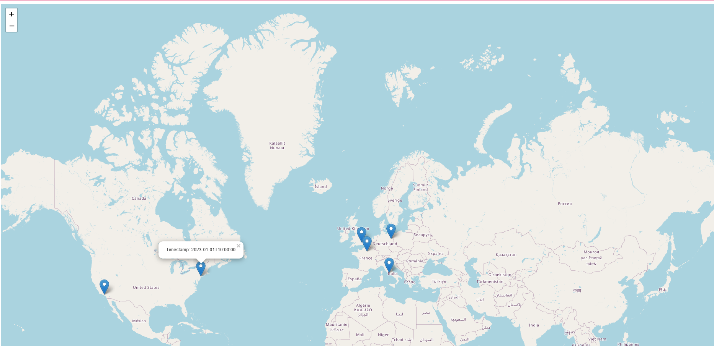
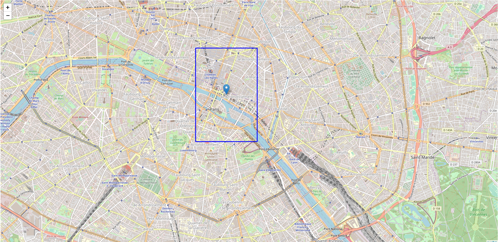

# README

Usage:
```shell
> python app.py
 * Serving Flask app 'app'
 * Debug mode: on
WARNING: This is a development server. Do not use it in a production deployment. Use a production WSGI server instead.
 * Running on http://127.0.0.1:1022
Press CTRL+C to quit
 * Restarting with stat
 * Debugger is active!
 * Debugger PIN: 133-191-632
127.0.0.1 - - [22/Oct/2023 18:53:41] "GET / HTTP/1.1" 200 -
127.0.0.1 - - [22/Oct/2023 18:53:42] "GET /static/script.js HTTP/1.1" 200 -
127.0.0.1 - - [22/Oct/2023 18:53:42] "GET /get_location_history HTTP/1.1" 200 -
```

Image:

